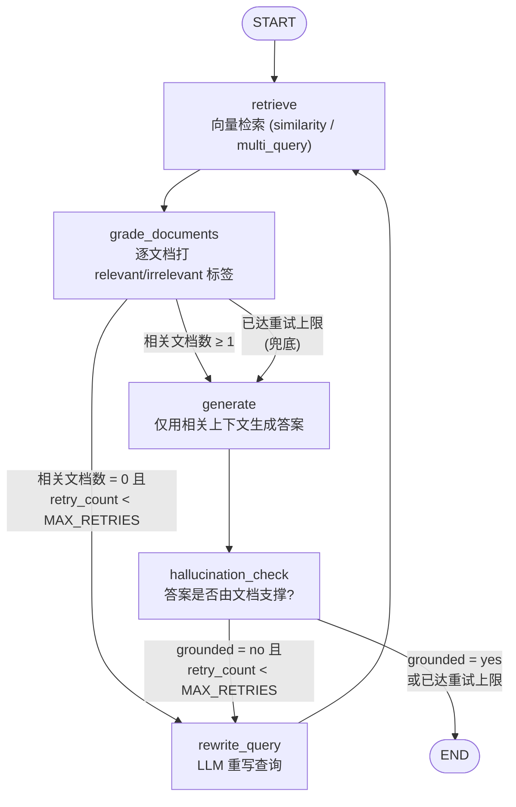

# rag-knowledge-agent

> 基于 **LangChain + LangGraph** 的**自反思（Self-Reflective）RAG 知识库 Agent**，具备多检索策略 + 文档评分 + 查询重写 + 幻觉检查的闭环能力，比"朴素向量 RAG"更工程化、更可靠。

---

## 目录

- [简介](#简介)
- [架构图](#架构图)
- [与朴素 RAG 的对比](#与-朴素-rag-的对比)
- [核心特性](#核心特性)
- [快速开始](#快速开始)
- [示例对话片段](#示例对话片段)
- [项目结构说明](#项目结构说明)
- [扩展点](#扩展点)
- [测试方法](#测试方法)
- [License](#license)

---

## 简介

`rag-knowledge-agent` 是一个面向**面试展示**与**生产可落地**的开源项目，演示如何用 LangGraph 把"检索 - 评分 - 重写 - 生成 - 幻觉检查"组织成一张带条件边的状态图。它不是简单调用一次 `vectorstore.similarity_search()` 就把结果丢给 LLM 的"玩具 RAG"，而是：

1. **检索**：支持 `similarity` 与 `multi_query` 两种召回策略；
2. **评分**：用 LLM 给每一条召回文档打 `relevant / irrelevant` 标签，过滤噪声；
3. **重写 + 重检索**：若所有文档都不相关，重写查询后回到检索，最多 `MAX_RETRIES` 次；
4. **生成**：仅用过滤后的相关上下文生成答案；
5. **幻觉检查**：生成后校验答案是否真的由文档支撑，否则再次触发重写闭环。

整个流程是一张显式的 LangGraph `StateGraph`，状态用 `TypedDict` 描述，节点是纯函数，可单测、可回放。

---

## 架构图



---

## 与朴素 RAG 的对比

| 维度 | 朴素 RAG | 本项目 (Self-Reflective RAG) |
|------|----------|------------------------------|
| 检索 | 单次向量相似检索 | `similarity` / `multi_query` 多策略，可切换 |
| 召回质量 | 不评估，噪声直接进上下文 | `grade_documents` 逐条评分过滤 |
| 查询失败 | 一次不行就放弃 | 重写查询后重新检索，最多 `MAX_RETRIES` 次 |
| 生成 | 直接生成 | 仅用相关片段生成，并附来源元数据 |
| 幻觉 | 无校验 | `hallucination_check` 确认答案由文档支撑 |
| 编排 | 一串隐式调用 | LangGraph 显式状态图，可回放/可单测 |
| 工程化 | 脚本式 | 配置化 + 工厂函数 + CLI + 测试 |

---

## 核心特性

- **LangGraph 状态图编排**：`retrieve → grade → rewrite → retrieve → generate → hallucination_check` 闭环，条件边驱动。
- **多检索策略**：`basic`（相似度）与 `multi_query`（LLM 生成多个 query 变体提高召回）。
- **文档评分（Corrective RAG）**：每条召回文档独立判分，过滤无关片段。
- **查询重写 + 重检索**：召回失败时自动改写 query，最多 `MAX_RETRIES` 次后兜底生成。
- **幻觉检查**：生成后校验答案是否由文档支撑，防止编造。
- **本地优先**：默认 `BAAI/bge-small-zh-v1.5` 本地 embedding + Chroma 持久化，可离线运行；也可一键切到 OpenAI 兼容 embedding API。
- **可 mock 的工厂函数**：`create_llm` / `create_embeddings` / `create_retriever` 集中构造，测试用 `monkeypatch` 替换即可，不依赖真实 API Key 与网络。
- **CLI 入口**：`ingest` / `ask` 两个子命令，`ask` 支持逐步打印状态流转，方便面试官看清流程。

---

## 快速开始

### 1. 安装依赖

```bash
cd rag-knowledge-agent
python -m venv .venv && . .venv/Scripts/activate   # Windows PowerShell
# 或 source .venv/bin/activate                      # macOS / Linux
pip install -r requirements.txt
```

`requirements.txt` 已锁定到验证通过的版本组合（langchain 1.4 / langgraph 1.2 / chromadb 0.5.3）。其中
`chromadb==0.5.3` 会自动带上 `chroma-hnswlib==0.7.3`（稳定版原生库），避免较新 `chromadb 1.x` 的 Rust
后端在某些 Windows 环境下的原生崩溃；`numpy<2` 是为兼容 chroma 原生扩展。

> 本地 embedding 默认会下载 `BAAI/bge-small-zh-v1.5`（约 100MB），首次联网、之后离线可用。
> 仅运行测试时不需要本地 embedding——测试用 fake embeddings，完全离线。

### 2. 配置环境变量

```bash
cp .env.example .env
# 编辑 .env，填入你的 OpenAI 兼容 API Key（如 DeepSeek、Moonshot、OpenAI）
```

`.env` 关键项：

```env
OPENAI_API_KEY=sk-xxx
OPENAI_BASE_URL=https://api.deepseek.com/v1
OPENAI_MODEL=deepseek-chat
EMBEDDING_PROVIDER=local        # local | openai
CHROMA_PERSIST_DIR=./chroma_db
TOP_K=4
MAX_RETRIES=2
```

### 3. 导入示例知识库

```bash
python main.py ingest --dir ./data
```

输出示例：

```
[ingest] loading documents from ./data ...
[ingest] loaded 1 document(s).
[ingest] chunked into 6 pieces.
[ingest] done. Vector store persisted.
```

### 4. 提问

```bash
python main.py ask "什么是 LangGraph 的条件边？" --strategy basic
```

加 `--strategy multi_query` 用多查询检索提高召回；`--no-stream` 只输出最终答案。

---

## 示例对话片段

```
$ python main.py ask "什么是 LangGraph 的条件边？" --strategy basic

[ask] question: 什么是 LangGraph 的条件边？
[ask] strategy: basic
[ask] running agent (streaming state per step) ...

--- step: retrieve ---
  documents: 4 kept
    [1] (data/sample_kb.txt) LangGraph 是 LangChain 团队推出的有状态编排框架，专门用于构建多步骤、多智能体的 LLM 应用...
    [2] (data/sample_kb.txt) 条件边（Conditional Edges）是 LangGraph 最关键的特性之一...
    ...
--- step: grade_documents ---
  documents: 3 kept
--- step: generate ---
  generation: 条件边是 LangGraph 的关键特性：它接收一个路由函数...
--- step: hallucination_check ---
  grounded: True

=== Final Answer ===
条件边（Conditional Edges）是 LangGraph 最关键的特性之一...
```

---

## 项目结构说明

```
rag-knowledge-agent/
├── README.md
├── requirements.txt
├── .env.example
├── .gitignore
├── LICENSE                    # MIT
├── pyproject.toml
├── main.py                    # CLI 入口：ingest / ask
├── data/                      # 示例文档目录
│   └── sample_kb.txt
├── chroma_db/                 # 运行时生成（已 gitignore）
└── src/
    └── rag_agent/
        ├── __init__.py
        ├── config.py          # Settings（环境变量 + 默认值）
        ├── llm.py             # LLM 工厂（OpenAI 兼容 ChatOpenAI）
        ├── embedder.py        # Embedding 工厂（local / openai）
        ├── loader.py          # 加载 .txt/.md/.pdf
        ├── chunker.py         # RecursiveCharacterTextSplitter 封装
        ├── vectorstore.py     # Chroma 持久化
        ├── retriever.py       # 多策略检索：similarity / multi_query
        ├── prompts.py         # 评分/重写/生成/幻觉检查 prompt
        ├── agent.py           # LangGraph 状态图 + 条件边
        └── cli.py             # argparse ingest/ask
└── tests/
    ├── __init__.py
    ├── conftest.py            # FakeLLM / FakeEmbeddings 等公共 fixture
    ├── test_chunker.py
    ├── test_loader.py
    ├── test_retriever.py       # in-memory Chroma + fake embeddings
    └── test_agent.py           # mock LLM，验证评分与重检索分支
```

---

## 扩展点

- **换 embedding**：设 `EMBEDDING_PROVIDER=openai` 并填 `OPENAI_EMBED_BASE_URL` / `OPENAI_EMBED_MODEL`，`create_embeddings()` 自动切换；本地模型可在 `config.py` 改 `LOCAL_EMBED_MODEL`。
- **加 rerank**：在 `retriever.py` 包一层 `ContextualCompressionRetriever` + reranker 模型（如 `bge-reranker`），或直接对 `retriever.invoke()` 结果二次排序后再交给 `agent.py` 的 `retrieve` 节点。
- **接入新数据源**：在 `loader.py` 增加新的 `DocumentLoader`（如 `UnstructuredMarkdownLoader`、Notion、网页），并在 `SUPPORTED_SUFFIXES` 注册后缀即可，下游切块/入库/检索零改动。
- **多 query 提示词**：修改 `prompts.py` 中的 `MULTI_QUERY_PROMPT` 即可调整变体数量与风格。
- **持久化更重**：把 Chroma 换成 Milvus / Qdrant，只需替换 `vectorstore.py` 的底层实现，`agent.py` 不感知。
- **人机协同**：LangGraph 的 checkpoint 天然支持 human-in-the-loop，可在 `grade_documents` 后插入中断让人工确认。

---

## 测试方法

测试**完全不依赖真实 API Key 与网络**：LLM 与 embedding 都用 `monkeypatch`/工厂替换成内存 fake，向量库用 `persist_directory=None` 的内存 Chroma（每个测试用唯一 collection 名隔离，避免内存客户端跨用例串数据）。

```bash
# 运行全部测试
pytest tests/ -v

# 只跑 agent 分支测试
pytest tests/test_agent.py -v

# 语法检查所有 .py（项目根目录执行）
python -m py_compile main.py src/rag_agent/*.py tests/*.py
```

测试覆盖：

- `test_chunker.py`：切块数量 / overlap 正确。
- `test_loader.py`：`.txt` / `.md` 能加载且 metadata 含 `source`。
- `test_retriever.py`：内存 Chroma + fake embedding 能检索回 mock 文档。
- `test_agent.py`：mock LLM 验证 `grade_documents` 过滤逻辑、`decide_after_grading` 触发重检索分支、`rewrite_query` 自增 `retry_count`、`MAX_RETRIES` 兜底。

---

## License

[MIT](./LICENSE)
