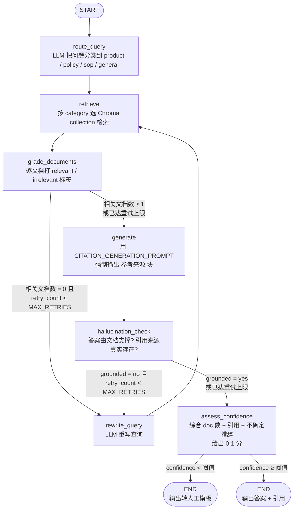

# 企业智能客服知识库 Agent

> 基于 **LangChain + LangGraph** 的**企业智能客服**知识库 Agent，具备多知识库路由 + 答案引用追溯 + 置信度兜底三大客服场景硬能力。从"通用 RAG 知识库 Agent"行业化为"企业智能客服知识库 Agent"——一个让面试官能直接看到具体业务场景落地的项目。

---

## 目录

- [业务场景](#业务场景)
- [架构图](#架构图)
- [与朴素 RAG 的对比](#与朴素-rag-的对比)
- [客服场景硬要求](#客服场景硬要求)
- [核心特性](#核心特性)
- [快速开始](#快速开始)
- [示例对话](#示例对话)
- [项目结构说明](#项目结构说明)
- [扩展点](#扩展点)
- [测试方法](#测试方法)
- [License](#license)

---

## 业务场景

用户在客服窗口问 **"我下单 3 天了还没发货怎么办"**——口语化、模糊、没有专业术语。系统按下述流程给出可追溯答案：

1. **意图识别与查询重写**：用户口语化提问（"退货"、"卡死了"）→ 路由分类器判断问题类别 + 查询重写器把口语改写为精准检索 query（"7 天无理由退货流程"、"支付失败常见原因"）。
2. **多知识库路由**：根据问题类别路由到不同 Chroma collection（产品 FAQ / 政策文档 / 操作 SOP），而不是一个大杂烩——避免无关语料稀释召回。
3. **答案引用来源标注**：每个答案必须标注引用来源（哪份文档的哪一段），客服必须可追溯——这是企业场景的硬要求。
4. **答案置信度评估**：低置信度时主动说 **"未找到明确答案，建议转人工客服"**，而不是幻觉胡编。

整条链路是一个显式的 LangGraph `StateGraph`，状态用 `TypedDict` 描述，节点是纯函数，可单测、可回放。

---

## 架构图



> Mermaid 兼容说明：节点 id 不使用 `END`/`TOOLS` 等保留字（故用 `START_NODE` / `end_node` / `end_ok`）；边标签使用 `-- "text" -->` 语法；含特殊字符的节点文本用引号包裹。

---

## 与朴素 RAG 的对比

| 维度 | 朴素 RAG | 本项目 (企业智能客服 Agent) |
|------|----------|------------------------------|
| 知识库 | 一个大杂烩 collection | **多知识库路由**：product / policy / sop / general 四个 collection，按问题类别路由 |
| 意图识别 | 无 | **route_query 节点**用 LLM 把口语化问题分类到 product / policy / sop / general |
| 检索 | 单次向量相似检索 | `similarity` / `multi_query` 多策略，可切换 |
| 召回质量 | 不评估，噪声直接进上下文 | `grade_documents` 逐条评分过滤 |
| 查询失败 | 一次不行就放弃 | 重写查询后重新检索，最多 `MAX_RETRIES` 次 |
| 答案可追溯 | 仅"基于上下文生成" | **强制 `**参考来源**` 块 + 引用幻觉检测**：答案引用了不存在的文档 → 标记幻觉 → 触发重写闭环 |
| 幻觉防护 | 无校验 | `hallucination_check` 双重校验：答案是否由文档支撑 + 引用是否真实存在 |
| 置信度 | 无 | **`assess_confidence` 节点**给出 0-1 分；低于阈值（默认 0.6）→ 输出"未找到明确答案，建议转人工客服"模板，绝不胡编 |
| 编排 | 一串隐式调用 | LangGraph 显式状态图，可回放 / 可单测 |
| 工程化 | 脚本式 | 配置化 + 工厂函数 + CLI（`--show-trace` / `--show-citations`）+ 102 个测试 |

---

## 客服场景硬要求

企业客服场景对 Agent 的硬要求，本项目都做了对应处理：

| 硬要求 | 实现位置 |
|--------|----------|
| **答案可追溯**：每条答案必须能查到出自哪份文档 | `prompts.CITATION_GENERATION_PROMPT` 强制输出 `**参考来源**` 块；`citation.extract_citations` 解析并校验引用 |
| **引用不能伪造**：引用的文档必须真实存在于检索结果 | `citation.has_hallucinated_citations` 检测；幻觉引用 → `hallucination_check` 强制 grounded=False → 触发 rewrite 闭环 |
| **低置信度不胡编**：检索不到 / 引用不全 → 主动转人工，不瞎编 | `confidence.assess_confidence` 综合 doc 数 + 引用 + 不确定措辞，低于 `CONFIDENCE_THRESHOLD` 时直接替换答案为 `FALLBACK_TEMPLATE` |
| **转人工机制**：触发关键词（"无法确定"、"建议联系人工"等）有清晰出口 | `confidence.FALLBACK_TEMPLATE` 包含 "建议转人工"，下游可 grep 触发工单系统 |
| **意图分类**：口语化提问要能识别意图并路由到对应知识库 | `router.route_query` LLM 分类 + 失败兜底到 general |

---

## 核心特性

- **多知识库路由（`router.py`）**：LLM 把用户问题分类到 `product` / `policy` / `sop` / `general` 之一，retrieve 节点按 category 选 Chroma collection。失败兜底到 `general`，绝不抛错。
- **答案引用追溯（`citation.py`）**：生成 prompt 强制输出 `**参考来源**` 块；`extract_citations(answer, documents)` 解析后做引用一致性校验——答案引用了不在检索结果里的文档 → 标记幻觉 → 触发 rewrite。
- **置信度评估（`confidence.py`）**：综合三信号给 0-1 分：
  - 检索到的相关文档数量（`grade_documents` 后的统计）
  - 答案是否包含已验证的引用来源
  - 答案是否包含"无法确定 / 建议联系人工 / 未找到"等不确定措辞
  - 阈值可配（默认 `CONFIDENCE_THRESHOLD=0.6`）：低于阈值 → 替换为"未找到明确答案，建议转人工客服"模板。
- **LangGraph 状态图编排**：`route_query → retrieve → grade_documents → rewrite/generate → hallucination_check → assess_confidence → END` 闭环，条件边驱动。
- **多检索策略**：`basic`（相似度）与 `multi_query`（LLM 生成多个 query 变体提高召回）。
- **文档评分（Corrective RAG）**：每条召回文档独立判分，过滤无关片段。
- **查询重写 + 重检索**：召回失败时自动改写 query，最多 `MAX_RETRIES` 次后兜底生成。
- **本地优先 + 可 mock**：默认 `BAAI/bge-small-zh-v1.5` 本地 embedding + Chroma 持久化，可离线运行；同时支持 `EMBEDDING_PROVIDER=fake` 用于无网络的 CLI smoke 测试。`create_llm` / `create_embeddings` / `create_retriever` 集中构造，测试用 `monkeypatch` 替换即可。
- **CLI 入口**：`ingest`（按文件名自动归类到对应 collection）/ `ask`（`--show-trace` 打印全流程、`--show-citations` 只看答案 + 引用）。

---

## 快速开始

### 1. 安装依赖

```bash
cd rag-knowledge-agent
python -m venv .venv && . .venv/Scripts/activate   # Windows PowerShell
# 或 source .venv/bin/activate                      # macOS / Linux
pip install -r requirements.txt
```

`requirements.txt` 已锁定到验证通过的版本组合（langchain 1.4 / langgraph 1.2 / chromadb 0.5.3）。其中
`chromadb==0.5.3` 会自动带上 `chroma-hnswlib==0.7.3`（稳定版原生库），避免较新 `chromadb 1.x` 的 Rust
后端在某些 Windows 环境下的原生崩溃；`numpy<2` 是为兼容 chroma 原生扩展。

> 本地 embedding 默认会下载 `BAAI/bge-small-zh-v1.5`（约 100MB），首次联网、之后离线可用。
> 仅运行测试或离线 smoke 测试时不需要本地 embedding——测试用 fake embeddings，CLI smoke 用 `EMBEDDING_PROVIDER=fake`，完全离线。

### 2. 配置环境变量

```bash
cp .env.example .env
# 编辑 .env，填入你的 OpenAI 兼容 API Key（如 DeepSeek、Moonshot、OpenAI）
```

`.env` 关键项：

```env
OPENAI_API_KEY=sk-xxx
OPENAI_BASE_URL=https://api.deepseek.com/v1
OPENAI_MODEL=deepseek-chat
EMBEDDING_PROVIDER=local        # local | openai | fake
CHROMA_PERSIST_DIR=./chroma_db
TOP_K=4
MAX_RETRIES=2

# 客服场景扩展项
CONFIDENCE_THRESHOLD=0.6        # 低于此分数 → 输出转人工模板
ENABLE_CITATION=true            # 是否强制 参考来源 块 + 引用幻觉检测
SHOW_TRACE=false                # ask 默认是否打印全流程
```

### 3. 导入客服知识库

```bash
python main.py ingest --dir ./data
```

`ingest` 会扫描 `data/` 下所有 `.txt` / `.md` / `.pdf`，按文件名启发式归类到对应 collection（`product_faq.txt → product`、`policy.md → policy`、`sop.md → sop`、其余 → `general`）。

输出示例（真实运行结果）：

```
[ingest] scanning 3 file(s) under ./data ...
[ingest] policy.md -> category=policy collection=rag_knowledge_policy chunks=5
[ingest] product_faq.txt -> category=product collection=rag_knowledge_product chunks=7
[ingest] sop.md -> category=sop collection=rag_knowledge_sop chunks=8
[ingest] done. Per-category chunk counts: policy=5, product=7, sop=8
```

**离线 smoke（无网络、无模型下载）**：

```powershell
$env:EMBEDDING_PROVIDER = "fake"; python main.py ingest --dir ./data
```

`EMBEDDING_PROVIDER=fake` 用一个确定性的 bag-of-words 嵌入（`embedder.FakeEmbeddings`），不下载任何模型、不联网，专用于 CI / smoke 测试。

### 4. 提问

```bash
# 打印 route → retrieve → grade → generate → confidence 全流程
python main.py ask "下单 3 天了还没发货怎么办" --show-trace

# 只看答案 + 引用
python main.py ask "7 天无理由怎么操作" --show-citations

# 关闭引用幻觉检测（用于对照实验）
python main.py ask "怎么开发票" --no-citation --show-trace
```

---

## 示例对话

```
$ python main.py ask "下单 3 天了还没发货怎么办" --show-trace

[ask] question: 下单 3 天了还没发货怎么办
[ask] strategy: basic
[ask] running customer-service agent (streaming state per step) ...

--- step: route_query ---
  category: product
--- step: retrieve ---
  documents: 4 kept
    [1] (data/product_faq.txt) Q：下单 3 天了还没发货怎么办？\nA：正常情况下现货商品会在付款后 48 小时内发货...
    [2] (data/product_faq.txt) Q：发货后多久能到？\nA：一线城市通常 1-2 天送达...
    ...
--- step: grade_documents ---
  documents: 3 kept
--- step: generate ---
  generation: 正常情况下现货商品会在付款后 48 小时内发货，超过承诺时间未发货可点"催发货"按钮催办商家；24 小时内仍未发货可申请客服介入...

**参考来源**：
- [product_faq.txt] 发货与物流：付款后 48 小时内发货
- [product_faq.txt] 发货与物流：催发货按钮催办商家
--- step: hallucination_check ---
  grounded: True
--- step: assess_confidence ---
  citations: 2 parsed
    [1] [OK] [product_faq.txt] 发货与物流：付款后 48 小时内发货
    [2] [OK] [product_faq.txt] 发货与物流：催发货按钮催办商家
  confidence: 0.73
  low_confidence: False

=== Final Answer ===
正常情况下现货商品会在付款后 48 小时内发货，超过承诺时间未发货可点"催发货"按钮催办商家...

confidence: 0.73
category: product
```

低置信度场景的兜底输出：

```
$ python main.py ask "公司上市财报怎么解读" --show-citations

=== Answer ===
未找到明确答案，建议转人工客服。

**说明**：当前知识库中未检索到与您问题高度匹配的内容，为避免给您提供不准确的信息，已为您转接人工客服。您也可以重新描述问题或提供订单号 / 商品链接以提升检索精度。

=== Citations ===
(no citations)

confidence: 0.15
```

---

## 项目结构说明

```
rag-knowledge-agent/
├── README.md
├── requirements.txt
├── .env.example
├── .gitignore
├── LICENSE                    # MIT
├── pyproject.toml
├── main.py                    # CLI 入口：ingest / ask
├── data/                      # 客服知识库示例文档
│   ├── product_faq.txt        # 电商产品 FAQ（订单/发货/退换货/支付/发票/会员）
│   ├── policy.md              # 退换货政策（7 天无理由/质量问题/三包/运费/特殊场景）
│   └── sop.md                 # 客服操作 SOP（工单/投诉/退款/升级转接/转人工时机）
├── chroma_db/                 # 运行时生成（已 gitignore，按 collection 分库存）
└── src/
    └── rag_agent/
        ├── __init__.py
        ├── config.py          # Settings（含 CONFIDENCE_THRESHOLD / ENABLE_CITATION / SHOW_TRACE）
        ├── llm.py             # LLM 工厂（OpenAI 兼容 ChatOpenAI）
        ├── embedder.py        # Embedding 工厂（local / openai / fake）
        ├── loader.py          # 加载 .txt/.md/.pdf
        ├── chunker.py         # RecursiveCharacterTextSplitter 封装
        ├── vectorstore.py     # Chroma 持久化（按 collection 分库）
        ├── retriever.py       # 多策略检索：similarity / multi_query
        ├── router.py          # 多知识库路由：route_query 节点 + classify_filename + collection_for_category
        ├── citation.py        # 答案引用解析与一致性校验：extract_citations / has_hallucinated_citations
        ├── confidence.py     # 置信度评估：assess_confidence + FALLBACK_TEMPLATE
        ├── prompts.py         # 评分/重写/生成/幻觉/路由/带引用生成 prompt
        ├── agent.py           # LangGraph 状态图：create_agent (CRAG) + create_customer_service_agent
        └── cli.py             # argparse ingest / ask（--show-trace / --show-citations）
└── tests/
    ├── __init__.py
    ├── conftest.py            # FakeLLM / FakeEmbeddings / cs_vectorstore_lookup 公共 fixture
    ├── test_chunker.py        # 切块数量 / overlap 正确
    ├── test_loader.py         # .txt / .md 加载与 metadata
    ├── test_retriever.py      # 内存 Chroma + fake embedding 检索
    ├── test_router.py         # 路由分类正确性、失败兜底、文件名归类
    ├── test_citation.py       # 引用解析、引用幻觉检测
    ├── test_confidence.py     # 低置信度转人工、高置信度正常输出
    └── test_agent.py          # mock LLM 验证 CRAG 闭环 + 客服图端到端（路由 / 转人工 / 引用幻觉）
```

---

## 扩展点

- **接工单系统**：当 `assess_confidence` 输出 `low_confidence=True` 或 generation 含 "建议转人工" 时，在 `cli.cmd_ask` 末尾插一段调用工单系统 API（如 Freshdesk / 自研 IM）创建工单，把 question + 检索片段 + 置信度一起传过去，由人工客服接管。也可以在 `agent.py` 的 `assess_confidence → END` 之间加一个 `create_ticket` 节点。
- **多轮对话上下文**：LangGraph 已天然支持 `checkpointer`（内存 / SQLite / Postgres）。把 `AgentState` 加一个 `chat_history: list[BaseMessage]` 字段，在 `route_query` 节点前用 LLM 把上一轮上下文与当前问题做指代消解（"那它的保修期是多久" → "上一轮提到的商品的保修期是多久"），再走原 retrieve 流程。`MemorySaver` 一行即可启用单进程多轮；`SqliteSaver` / `PostgresSaver` 用于生产。
- **换 embedding**：设 `EMBEDDING_PROVIDER=openai` 并填 `OPENAI_EMBED_BASE_URL` / `OPENAI_EMBED_MODEL`，`create_embeddings()` 自动切换；本地模型可在 `config.py` 改 `LOCAL_EMBED_MODEL`。`fake` 用于 CI / 离线 smoke。
- **加 rerank**：在 `retriever.py` 包一层 `ContextualCompressionRetriever` + reranker 模型（如 `bge-reranker`），或直接对 `retriever.invoke()` 结果二次排序后再交给 `agent.py` 的 `retrieve` 节点。
- **接入新数据源**：在 `loader.py` 增加新的 `DocumentLoader`（如 `UnstructuredMarkdownLoader`、Notion、网页），并在 `SUPPORTED_SUFFIXES` 注册后缀即可，下游切块 / 入库 / 检索零改动。新增类别只需在 `router.classify_filename` + `CATEGORY_TO_COLLECTION` 各加一行。
- **多 query 提示词**：修改 `prompts.py` 中的 `MULTI_QUERY_PROMPT` 即可调整变体数量与风格。
- **持久化更重**：把 Chroma 换成 Milvus / Qdrant，只需替换 `vectorstore.py` 的底层实现，`agent.py` 不感知。
- **人机协同**：LangGraph 的 checkpoint 天然支持 human-in-the-loop，可在 `grade_documents` 后插入中断让人工确认，或在 `assess_confidence` 后中断让人工审核低置信度答案再决定是否放行。

---

## 测试方法

测试**完全不依赖真实 API Key 与网络**：LLM 与 embedding 都用 `monkeypatch`/工厂替换成内存 fake，向量库用 `persist_directory=None` 的内存 Chroma（每个测试用唯一 collection 名隔离，避免内存客户端跨用例串数据）。

```bash
# 运行全部测试（102 个，全部不依赖 API / 网络）
pytest tests/ -v

# 只跑客服图端到端测试
pytest tests/test_agent.py -v -k customer_service

# 只跑路由 / 引用 / 置信度单测
pytest tests/test_router.py tests/test_citation.py tests/test_confidence.py -v

# 语法检查所有 .py（项目根目录执行）
python -m py_compile main.py src/rag_agent/*.py tests/*.py
```

测试覆盖：

- `test_chunker.py`：切块数量 / overlap 正确。
- `test_loader.py`：`.txt` / `.md` 能加载且 metadata 含 `source`。
- `test_retriever.py`：内存 Chroma + fake embedding 能检索回 mock 文档。
- `test_router.py`：路由 JSON 解析（含 code fence / prose 包裹 / 失败兜底）、`route_query` 节点 LLM 异常兜底、文件名归类、collection 映射。
- `test_citation.py`：引用解析（bracket / 半角冒号 / 无 bold 标记 / 未结构化 bullet）、引用一致性校验（路径 basename / 子串匹配）、引用幻觉检测、`build_citation_context` 与 `extract_citations` 的 round-trip。
- `test_confidence.py`：高置信度保留原答案、低置信度替换为转人工模板、不确定措辞扣分、引用幻觉硬扣分、`enable_citation=False` 中性化、`citations` 未预填时节点重新解析。
- `test_agent.py`：
  - 14 个 CRAG 闭环单测（评分 / 重写 / 重试上限 / happy path / rewrite 分支 / 幻觉闭环）；
  - 客服图端到端：product 类问题路由到 product collection；低置信度走转人工模板；引用幻觉触发 rewrite 后给出真实引用。

---

## License

[MIT](./LICENSE)
